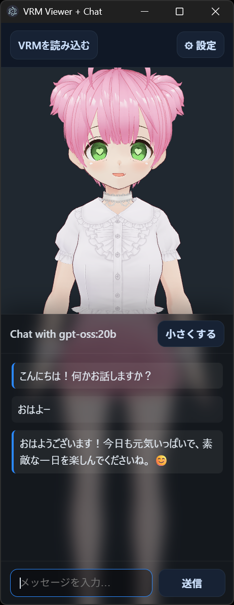

# my-ai-friends
AIのお友達

<p align="center">
	
</p>

# my-ai-friends
AIのお友達 — VRMビューワーとチャットを組み合わせたデスクトップアプリ（Electron）

概要
----
`my-ai-friends` はローカルで動く軽量な Electron アプリです。VRMモデルを読み込み、3D 表示しながらチャットインターフェイスでモデルと会話できます。VoiceVox 等のローカル音声合成を接続して発話を再生することも可能です。

主な特徴
- VRM（.vrm）をドラッグ＆ドロップで読み込み、three.js + @pixiv/three-vrm で表示
- モデルに合わせた待機アニメや口パクを再生する設定
- ビルド済みの小さなチャット UI を内蔵（下部固定のチャットパネル）
- システムプロンプトや「ペルソナ」プリセットで応答の口調を調整
- VoiceVox のエンドポイントを指定してローカル合成（再生）可能

ファイル構成（主要）
- `index.html` — アプリ UI のエントリ（importmap を利用）
- `main.js` — Electron の起動ロジック
- `js/` — アプリのフロントエンドロジック（`app.js`, `chat.js`, `viewer.js`）
- `style.css` — UI スタイル
- `my-ai-friends.png` — README 用の画像（先頭に表示）
- `package.json` — 依存・起動スクリプト（Electron を使用）

必要環境（想定）
- Node.js（推奨: 16.x 以上）
- npm
- ローカルでの音声合成に VoiceVox を利用する場合は VoiceVox Server（例: `http://127.0.0.1:50021`）を起動しておく

インストールと起動（Windows / PowerShell）
```powershell
# 依存をインストール
npm install

# Electron アプリを起動
npm start
```

使い方（ざっくり）
1. アプリを起動するとウィンドウが開きます。
2. ヘッダの「VRMを読み込む」ボタンまたは `index.html` のドラッグ領域に `.vrm` ファイルをドロップして読み込みます。
3. 画面下部のチャット欄でテキストを入力して送信すると、応答がチャットログに表示されます。
4. 設定パネル（画面右上の歯車ボタン）で待機アニメや口パク、VoiceVox のエンドポイント・話者設定などを変更できます。

開発メモ
- 依存は `three`, `@pixiv/three-vrm`, `meshoptimizer` を使用しています（`package.json` を参照）。
- アプリは ESM（`type: "module"`）で作られています。

トラブルシュート
- 起動できない場合は Node と npm のバージョンを確認してください。
- VoiceVox を使う場合は、VoiceVox のエンドポイントが正しいか、ローカルでサーバが動作しているかを確認してください。

貢献
- バグ報告や機能提案は Issue を立ててください。簡単な変更であれば Pull Request歓迎です。

ライセンス
- リポジトリ内の `LICENSE` を参照してください。

補足（仮定）
- Node.js の最低バージョンは明示されていなかったため、近年の Electron と依存ライブラリに合わせて Node.js 16+ を推奨としました。必要に応じて指定バージョンに合わせて調整してください。

要件カバレッジ（この README 作成時点）
- my-ai-friends.png を README の先頭に表示 — Done
- プロジェクト全体を把握して README を作成 — Done（`index.html`, `main.js`, `package.json`, `style.css`, `js/` を参照）

---
上記で一通り README を作成しました。必要なら日本語の説明を簡潔にしたり、スクリーンショット追加、実際の起動例（動画GIF）を追記します。

